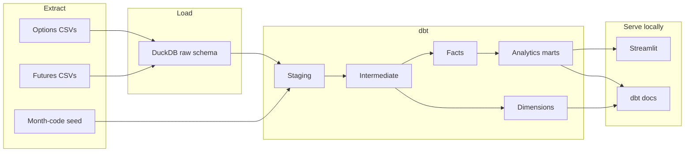

# Architecture

Local-only Version 1 stack: **Python + DuckDB + dbt Core + Streamlit**.

```text
CSV extracts                DuckDB warehouse                 Presentation
-------------               -----------------               -------------
raw_underlyings.csv         raw.*          (landed)         Streamlit
raw_futures_contracts.csv   staging.*      (views)          dbt docs
raw_futures_prices.csv      intermediate.* (views)
raw_options_chain.csv       marts.*        (tables)
                            snapshots.*    (SCD-style)
```



Custom schemas are real DuckDB schemas (`raw`, `staging`, `intermediate`, `marts`, `snapshots`) via `macros/generate_schema_name.sql`.

Snowflake is an intentional non-goal for Version 1 so the project stays fully local.
